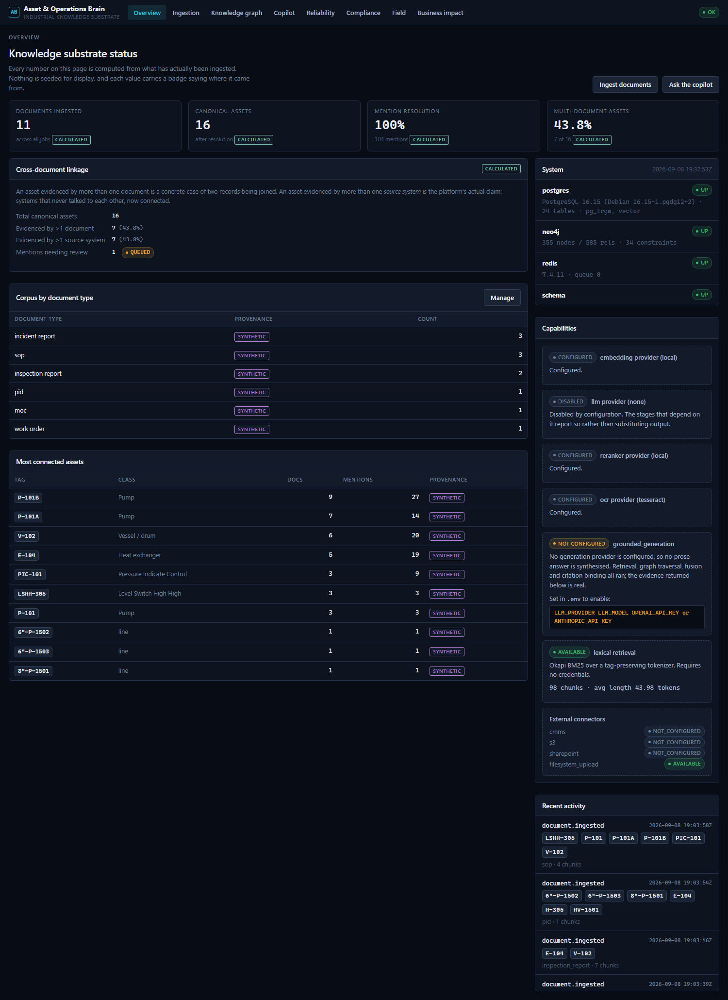
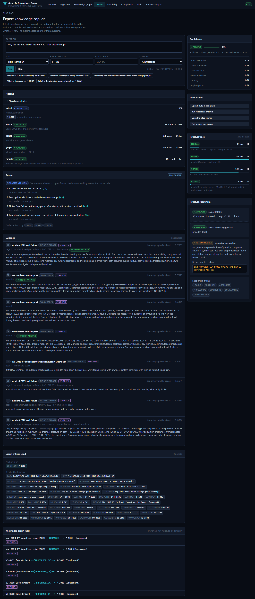
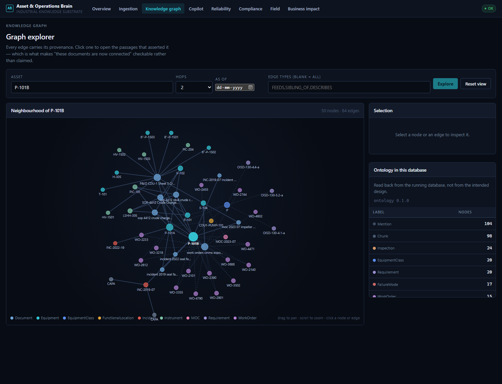
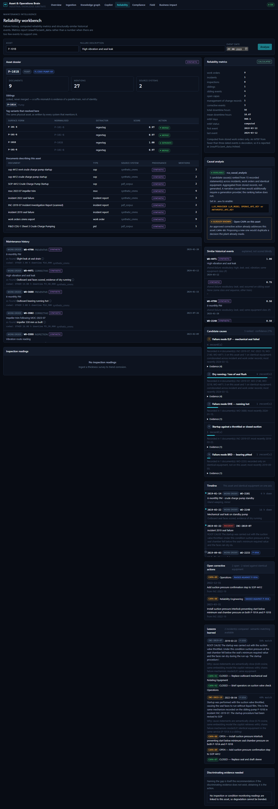
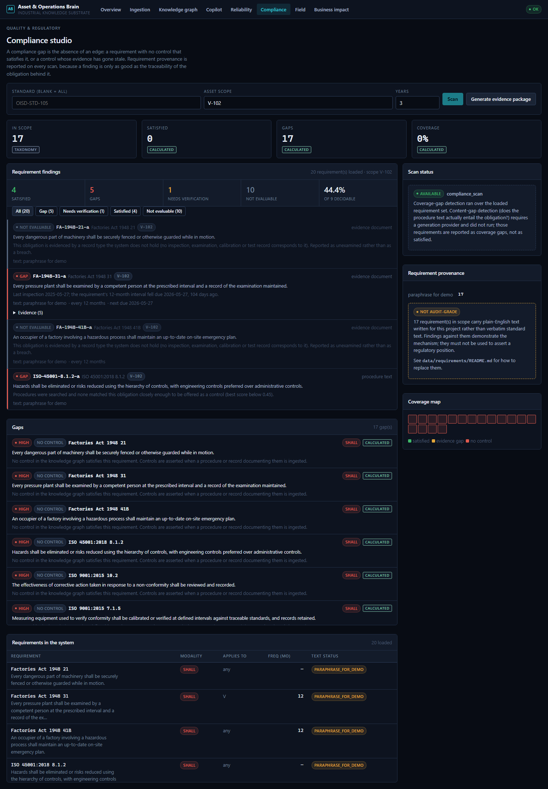
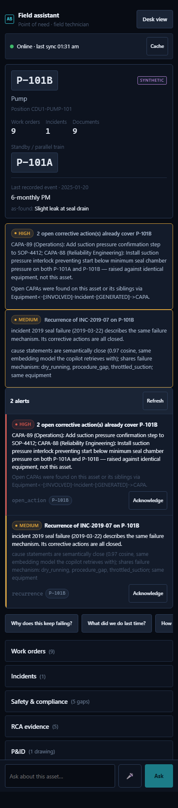

# Unified Asset & Operations Brain

> *"The plant already knows the answer. It just can't remember where it wrote it down."*

One shared industrial knowledge substrate. Document ingestion, entity resolution,
a provenance-carrying knowledge graph, and hybrid retrieval — with the five
capabilities from the brief built as query patterns over it rather than as five
separate demos.

**This is a production-oriented prototype, not a production system.** It runs
end to end from a destroyed database with one command, and it has no
authentication, one tenant, and a corpus of eleven documents. This README
separates what runs from what does not; every number in it was measured, and
anything unmeasured says so.

---

## 1. The problem

A refinery pump fails. Somewhere in the plant, the answer already exists:

* a **2019 incident report** that is a photograph of a piece of paper,
* a **2022 incident** on the sibling pump, filed under a different tag spelling,
* a **management-of-change record** that trimmed the impeller and never updated
  the datasheet,
* fifteen **work orders** in the CMMS, half with the dropdown-default failure code,
* an **SOP** that exists in three revisions, two of them superseded,
* and a **P&ID** where the pump is a circle with a label.

Six documents, four formats, two systems, no shared identifier. The pump is
written six different ways across them — `P-101B`, `P101B`, `P 101 B`,
`10-P-101-B`, `P-101-B` — and the one thing no keyword search can do is tell you
that `P-101A` one character away is a **different pump**.

So the knowledge exists and is unreachable. A technician at the machine asks the
person who has been there longest. When that person retires, the answer leaves
with them.

**What this system does:** ingests those documents as they actually are, resolves
the six spellings to one asset without merging the sibling, builds a graph where
every asserted fact keeps its source document, page and confidence, and answers
questions from it with citations that open the page they came from — or refuses,
and says who to ask instead.

**What it will not do:** answer from general knowledge. With no LLM configured,
answers are assembled from verbatim spans of cited passages, so an answer that is
not in the corpus is structurally impossible rather than merely discouraged.

---

## 2. Architecture

Seven layers, one substrate. The five capabilities in the brief are query
patterns over it, not five separate products.

```
┌──────────────────────────────────────────────────────────────────────────────┐
│ L7  EXPERIENCE     web/ — vanilla HTML/CSS/JS, served by the API at /ui       │
│     index · ingestion · graph · copilot · reliability · compliance ·          │
│     field (mobile) · impact                                                   │
└───────────────────────────────┬──────────────────────────────────────────────┘
                                │  REST + SSE, same origin, no CORS shim
┌───────────────────────────────┴──────────────────────────────────────────────┐
│ L6  AGENTS         RCA · Compliance · Lessons learned · Proactive             │
│     Deterministic parts run; reasoning parts are capability-gated and say so. │
└───────────────────────────────┬──────────────────────────────────────────────┘
┌───────────────────────────────┴──────────────────────────────────────────────┐
│ L5  RETRIEVAL & REASONING      services/retrieval/                            │
│     intent → [lexical ‖ dense ‖ graph] → RRF → rerank → assemble →            │
│     compose → citation binding → verify → confidence → answer | abstain       │
└───────────────────────────────┬──────────────────────────────────────────────┘
┌───────────────────────────────┴──────────────────────────────────────────────┐
│ L4  KNOWLEDGE STORES                                                          │
│  ┌────────────────────────────────────────┐ ┌────────────┐ ┌──────────────┐   │
│  │ PostgreSQL 16 + pgvector               │ │ Neo4j 5    │ │ Redis 7      │   │
│  │ records · chunks · BM25 · vectors      │ │ knowledge  │ │ job queue    │   │
│  │ query log · citations · review queue   │ │ graph      │ │ event bus    │   │
│  └────────────────────────────────────────┘ └────────────┘ └──────────────┘   │
└───────────────────────────────┬──────────────────────────────────────────────┘
┌───────────────────────────────┴──────────────────────────────────────────────┐
│ L3  KNOWLEDGE CONSTRUCTION     extract → normalise → parse → block → score →  │
│     decide (merge | sibling | review | separate) → upsert with provenance     │
└───────────────────────────────┬──────────────────────────────────────────────┘
┌───────────────────────────────┴──────────────────────────────────────────────┐
│ L2  DOCUMENT UNDERSTANDING     classify → parse (pdf│text│docx│tabular│image) │
│     → OCR where there is no text layer → structure-aware chunk → index        │
└───────────────────────────────┬──────────────────────────────────────────────┘
┌───────────────────────────────┴──────────────────────────────────────────────┐
│ L1  INGESTION      validate → content-address (SHA-256) → dedup → durable job │
│     → reliable queue.  Idempotent: re-ingesting a corpus converges.           │
└──────────────────────────────────────────────────────────────────────────────┘
        ▲                                                                 │
        └──────── FEEDBACK: thumbs, corrections, review queue ◄────────────┘
```

Three paths run through it — the **write path** (documents become knowledge,
asynchronous), the **read path** (questions become grounded answers,
synchronous), and the **proactive path** (the event bus, which carries events
today; the pattern-matching engine that would turn one into a pushed warning is
not implemented and the API says so).

Full detail, including the entity-resolution decision table and the
functional-location/equipment split: **[docs/architecture.md](docs/architecture.md)**.

---

## 3. Tech stack

| Layer | Choice | Why this one |
|---|---|---|
| API | **FastAPI** + Pydantic v2 | typed contracts that generate the OpenAPI schema, and async that matches an I/O-bound retrieval fan-out |
| Relational | **PostgreSQL 16** | records, chunks, the query log — and one database instead of two |
| Lexical search | **Okapi BM25 in SQL** | exact tag matching is non-negotiable here; `P-101B` must not be stemmed into `P-101A` |
| Vectors | **pgvector**, HNSW, cosine | same database as the rows the vectors describe: no second store to keep consistent |
| Embeddings | **fastembed** ONNX, `BAAI/bge-small-en-v1.5` (384-dim) | runs on CPU with no credential and no torch — the air-gapped path stays real |
| Reranking | **`Xenova/ms-marco-MiniLM-L-6-v2`** cross-encoder, ONNX | the published MS MARCO model, not a hand-rolled similarity |
| Graph | **Neo4j 5** | multi-hop traversal with properties on edges, which is where provenance lives |
| Queue & bus | **Redis 7** | durable ingestion jobs and the SSE event stream |
| OCR | **Tesseract** | offline, no credential, no network call at run time |
| Drawings | **pdfplumber** geometry + **OpenCV** Hough transforms | classical CV needs no training data, so no accuracy figure has to be invented |
| Frontend | **vanilla HTML5 / CSS3 / ES modules** | no build step, no framework; one HTML file per surface |
| Runtime | **Docker Compose**, 5 containers | one command from nothing to a working system |

Ten languages, each doing real work: Python (services, eval, generators),
JavaScript (dashboard), HTML, CSS, SQL (7 migrations, the BM25 scoring function),
Cypher (constraints, ontology seed, traversals), YAML (compose, CI), Shell
(clean-room test, helper scripts), JSON (requirements, manifests, eval fixtures),
Markdown (documentation and the synthetic corpus itself).

**No LLM is required.** Generation is capability-gated: with no provider
configured the extractive composer answers from verbatim spans, and the API
reports which stage did what.

---
## 4. Quickstart


Requires Docker and Python 3.11+. No credentials needed.

```bash
cp .env.example .env    # then set POSTGRES_PASSWORD and NEO4J_PASSWORD
docker compose up -d --build

python data/synthetic/generate.py        # CSV exports + Markdown reports
# generate_pdfs.py needs reportlab, which is a dev-only dependency: it produces
# the test PDFs, and the runtime image only needs to read them.
pip install reportlab==4.2.5
python data/synthetic/generate_pdfs.py   # real PDFs, incl. an image-only scan and a P&ID

python scripts/ingest_dir.py data/synthetic/generated \
  --data-class synthetic_test_data --source-system synthetic_cmms --wait
python scripts/ingest_dir.py data/synthetic/generated_pdf \
  --data-class synthetic_test_data --source-system pdf_corpus --wait
```

Then open **http://localhost:8000** (API docs at `/docs`, Neo4j browser at
`:7474`).

```bash
docker compose exec api python scripts/load_requirements.py   # compliance corpus
python eval/run_eval.py                                       # the numbers above
python -m pytest -q -m "not integration"                      # 402 unit tests
python -m pytest -q -m integration                            # 84 API + security tests
```

The OCR tests skip unless `tesseract` is on your PATH. It is installed in the
image, so to run them where it lives:

```bash
docker compose exec api sh -c "cd /app && python -m pytest tests/test_pdf_and_ocr.py -q"
```

Verify the whole thing from nothing:

```bash
./scripts/clean_start_test.sh     # destroys volumes, rebuilds, ingests, tests
```

`make help` lists every target. On Windows without GNU make, run the commands
directly — they are all one-liners.

---

## 5. Measured results


Produced by `python eval/run_eval.py` against a live stack: **55 golden
questions** (16.4% deliberately unanswerable), a hand-labelled entity reference
set, and the live graph. Every run is saved to `eval/results/` with the
configuration it ran under; `python eval/compare_runs.py` diffs any two.

Run: `20260908T195645Z-day7-final`, 55 cases, 0 errored, against a stack rebuilt
from destroyed volumes minutes earlier.

| Metric | Result | Method |
|---|---|---|
| **Entity precision** | **0.929** | 11 hand-labelled documents, `eval/entities.jsonl` |
| **Entity recall** | **0.907** | same reference set |
| **Entity F1** | **0.918** | micro-averaged; 39 TP / 3 FP / 4 FN |
| **Citation validity** | **1.000** | 440/440 cited chunks re-fetched and snippets verified against stored text |
| **Groundedness** | **1.000** | 170/170 answer claims verbatim in the passage they cite |
| **Answer correctness** | **Not measured** | 41 answers produced; grading needs a judge, and none is configured |
| Context recall | 0.956 | golden set, answerable questions |
| Context precision | 0.426 | 8 passages returned per question |
| Intent routing accuracy | 0.836 | deterministic rule classifier |
| **Abstention recall (unanswerable)** | **0.667** | 9 unanswerable questions; 6 refused |
| **False abstention rate** | **0.109** | 5 of 46 answerable questions withheld |
| Abstentions naming a referral | 1.000 | never a bare refusal |
| **Compliance gap detection** | **1.000** | 13/13 hand-determined verdicts, `eval/compliance_expectations.jsonl` |
| **Mention resolution** | **1.000** | 104 of 104 extracted tags reached a canonical asset |
| **Drawing tag linkage** | **1.000** | 12 of 12 tags detected on the P&ID resolved to an asset |
| Cross-system assets | 0.438 | 7 of 16 assets evidenced by more than one source system |
| Review queue open | 1 | one ambiguous resolution awaiting a human |
| **Latency p50 / p95** | **2.79 s / 4.04 s** | 55-question benchmark |
| Time-to-answer improvement | **Not measured** | protocol written, study **NOT YET RUN** — `docs/time-to-answer.md` |

Full methodology, and what each number does *not* establish:
**[docs/evaluation.md](docs/evaluation.md)**.

### Reading these honestly

**Two rows are pairs, not standalone numbers.** Abstention recall (0.667) and
false abstention (0.109) can each be driven to a perfect score by a system that
always or never refuses; only together do they say anything. Likewise entity
precision and recall: reporting recall alone would hide invented equipment.

**Answer correctness is `not_measured`, not zero.** The extractive answerer
produced 41 real cited answers in this run with no credential of any kind, but
grading them against a reference needs a judge — a human or a capable LLM — and
neither is configured. A string-overlap score presented as accuracy would be
worse than no number.

**Groundedness is not correctness.** 1.000 says every claim appears verbatim in
the passage it cites. It does not say the claim answers the question, or that
the right passage was chosen.

**p95 is 4.04 s and still misses a sub-2-second target.** The cross-encoder is
essentially all of it — 3.37 s of the 4.04 s, against 0.15 s for dense, 0.32 s
for graph and 0.01 s for lexical. It is a 6-layer transformer scoring 25
candidates on a container CPU with no GPU, and the host is Docker Desktop on
Windows, where the same query has measured anywhere from 2.8 s to 11.4 s across
sessions. The dials are `RERANK_CANDIDATES` and `ONNX_THREADS`; a repeated
question is served from the reranker cache in ~130 ms. The measured number is
printed rather than the target, and it moves between runs — the Day 6 run of the
same benchmark measured 6.52 s.

**One row moved for a reason worth stating.** The review queue holds 1 item in
this run against 0 in the Day 6 run. Revision extraction was corrected on Day 7
(a document's revision is now read only from its own header field, not from a
sentence mentioning another document's revision), which changed what the
resolver saw. One ambiguous mention now waits for a human instead of being
resolved silently, which is the behaviour the four-way decision exists to
produce.

**The corpus is 11 synthetic documents.** Every figure above is real and
reproducible, and none of it establishes behaviour at plant scale.

### What the benchmark caught

The expanded set found three defects that the 25-question version did not:

1. **A tag-extraction bug that both invented and destroyed assets.** `T-101
   P-101A` on the P&ID matched as a single tag `T-101 P` — creating equipment
   that does not exist and swallowing the duty pump entirely. Entity precision
   rose 0.848 → 0.929 when fixed.
2. **A latency cliff.** p95 reached 17 s under sustained load. A reranker cache
   keyed on the exact query and candidate set brought repeated questions to
   ~130 ms and p95 to 6.52 s.
3. **A dangerous shape of wrong answer.** "What is the current vibration reading
   on P-101A?" returned a real, well-cited reading from 2023. Everything about it
   was right except that it was two years stale. A live-state gate now refuses
   present-tense measurement questions and says why; abstention recall rose
   0.556 → 0.667.

4. **A document inheriting another document's revision number.** Revision was
   read by finding the first occurrence of the word "revision" in the header and
   taking the number after it — so an incident report saying *"the procedure had
   been revised to SOP-4412 revision 3"* was recorded as revision 3 itself. Two
   incident reports and one MOC carried a revision they do not have, and
   `order_revisions` treats that field as ordering evidence, so a fabricated
   label can declare a real document superseded. Revision is now read only from a
   labelled field in the document's own header block. The same fix also
   *recovered* two revisions that had been missed: the PDF SOP, whose header
   pdfplumber collapses onto one line, and the P&ID, whose title block reads
   `DWG No: PID-CDU1-003 REV: 4`.
5. **A citation that knew it was superseded and did not say so.** The retrieval
   pipeline has always carried `is_current` per passage — the confidence score
   has a currency signal computed from it, and the assembled context marks
   superseded passages — but the `Citation` returned to the browser dropped it.
   A superseded SOP and the current one rendered identically in the evidence
   list, and the only way to find out was to open the document. Citations now
   carry `is_current` and `revision`, and both the copilot and the field view
   badge them.

Three of the harness's own metrics were also wrong and were fixed: intent
expectations missing for two new categories, linkage reading a rate above 1, and
compliance expectations that scoped a pressure-vessel clause to a heat exchanger.
In that last case **the system was right and the reference set was wrong.**

Corpus behind these numbers: 11 documents (4 PDFs including one image-only scan
and one P&ID, 2 CSV exports, 5 Markdown) → 98 chunks → 104 mentions → 16
canonical assets → 2 incidents, 5 corrective actions, 1 MOC, 20 requirements,
465 drawing detections.

---

## 6. Screenshots

Eight surfaces, one backend. Every value on every one of them arrives over HTTP
from the same API — there is no fixture mode and no second code path for the
demo.

| Surface | What it is for |
|---|---|
| `index.html` | corpus, entity layer and live system status |
| `ingestion.html` | jobs with a per-stage report, including stages that could not run |
| `graph.html` | force-directed neighbourhood; click an edge for its evidence |
| `copilot.html` | the read path, streamed stage by stage, with citations and confidence |
| `reliability.html` | RCA candidate causes ranked from records, and precedents |
| `compliance.html` | requirement verdicts, with the decidable subset named |
| `field.html` | the phone view for someone standing at the machine |
| `impact.html` | the ROI model, every field labelled by where its number came from |


*Overview — corpus and entity-layer counts, read live.*


*Copilot — a grounded answer, its citations, and the confidence breakdown.*


*Knowledge graph — P-101B's neighbourhood. P-101A is linked as a sibling, never merged.*


*Reliability — candidate causes ranked from recorded evidence, with the confidence stated.*


*Compliance — verdicts per requirement, and coverage over the decidable subset only.*


*Field — same backend, same citations, sized for a phone at the machine.*

To see them live: `docker compose up -d`, then
**http://localhost:8000/ui/index.html**. The twelve-step walkthrough is
[docs/demo_script.md](docs/demo_script.md).

---

## 7. Data sources

**The running corpus is synthetic, and says so on every value it produces.**

| | |
|---|---|
| **Loaded now** | 11 documents → 98 chunks → 104 mentions → 16 canonical assets, plus 20 requirements |
| **Formats** | 4 PDFs (one image-only scan, one P&ID), 2 CSV exports, 5 Markdown |
| **Classes** | SOP, work order, inspection report, incident report, MOC, P&ID |
| **Systems** | two — so "cross-system corroboration" is a claim the corpus can support |
| **Provenance** | every row `synthetic_test_data`; every file carries a banner in its own text |

`data/synthetic/generate.py` is **scripted, not sampled**: the plant model and
the failure history are written out explicitly so the corpus has a causal story,
and only the surface forms vary under a seeded PRNG — which is where the
deliberate messiness lives (six tag spellings, dropdown-default failure codes,
missing close-out dates, technician shorthand). Same seed, byte-identical
output, verified in CI by generating twice and diffing.

`data/corpus/` is where **real** documents go. It ships empty by design, and
[SOURCES.md](data/corpus/SOURCES.md) names legally usable sources per document
class. Adding real documents raises the ceiling on every metric below;
synthetic-only data caps it.

All 20 requirements are `paraphrase_for_demo`, not verbatim standard text, and
the API returns that breakdown so a coverage figure built on paraphrase is
visibly one.

Full detail: **[docs/data-sources.md](docs/data-sources.md)**.

---

## 8. API overview

41 operations across 12 tags, all under `/api/v1` except the health probes.
Interactive docs at `/docs`, schema at `/openapi.json`.

```
GET  /health                          every store probed with a real query
POST /api/v1/ingest                   upload; returns a job id
GET  /api/v1/ingest/{job_id}          per-stage report, including what could not run
POST /api/v1/query                    the copilot: answer + citations + confidence
POST /api/v1/query/stream             the same, streamed stage by stage (SSE)
GET  /api/v1/documents/{id}/chunks/{id}   the evidence behind a citation
GET  /api/v1/graph/{asset}            neighbourhood, with evidence on every edge
POST /api/v1/rca                      candidate causes ranked from records
GET  /api/v1/compliance/evaluate      verdicts, over the decidable subset
GET  /api/v1/drawings/locate/{tag}    where an asset appears on a drawing
GET  /api/v1/events/stream            the system event bus (SSE)
```

**One error envelope** for every failure — `{"error": {code, message, detail}}`
— with a stable machine `code`, and `x-request-id` on every response, echoed in
the dashboard's error state and on every log line for that request.

**A stage that cannot run reports itself** rather than being skipped, naming the
environment variables that would enable it. **Every displayable value carries a
`data_class`**, rendered as a badge and never inferred client-side.

There is **no authentication**. It is single-tenant and bound to localhost; the
`role` field personalises retrieval but is not an authorisation boundary. See
[docs/security.md](docs/security.md).

Full reference, generated from the schema by `python scripts/gen_api_docs.py`:
**[docs/api.md](docs/api.md)**.

---

## 9. Evaluation methodology

Every number in this README came from `python eval/run_eval.py` against a live
stack. Runs are written to `eval/results/` with the configuration they ran under;
`python eval/compare_runs.py` diffs any two and flags movement above a 0.02 noise
floor.

* **55 golden questions**, of which **16.4% are deliberately unanswerable** —
  because a benchmark made only of answerable questions rewards a system that
  always answers, which is the failure mode that matters most here.
* **A hand-labelled entity reference set** over 11 documents, scored for
  precision *and* recall: recall alone hides invented equipment, precision alone
  hides equipment silently dropped.
* **Citations re-fetched and re-verified** — 440 of 440 — because a retrieval
  score means nothing if the evidence trail behind it does not resolve.
* **Compliance verdicts** graded only where the answer is decidable from stored
  evidence; modes whose correct answer is "a human must decide" are excluded
  rather than graded.

Two things are **not measured** and are reported as such, never as zero: answer
correctness (no judge is configured) and time-to-answer improvement (the study
protocol exists and has not been run).

Full methodology, including what the benchmark has caught:
**[docs/evaluation.md](docs/evaluation.md)**.

---

## 10. Known limitations


Stated plainly, because a limitation you name is worth more than one a reviewer
finds.

1. **Latency p95 is 4.04 s, not the sub-2-second target.** The cross-encoder is
   ~83% of it. It also moves between runs on this host — the same benchmark
   measured 6.52 s the day before. Real, measured, and printed rather than the
   target; see the measured-results section for the breakdown and the dials.
2. **Answer correctness is unmeasured.** No judge is configured, so groundedness
   (1.000) is reported and correctness is not. Groundedness says the answer came
   from the corpus; it does not say the answer is right.
3. **Abstention recall is 0.667**, and the three misses are instructive: two ask
   for a field a real document does not contain (a seal part number, a shift
   roster), which lexical relevance cannot distinguish from a document that does.
   The original four unanswerable questions still score 0.750 exactly as on
   Day 3 — the rate fell because the benchmark got harder, not the system.
4. **No time-to-answer study has been run.** The protocol exists; the ROI model
   labels its time inputs as assumptions accordingly.
5. **Equipment-symbol detection is not implemented.** Tags, instrument bubbles
   and pipe runs are detected without training data; classifying a pump against a
   vessel by silhouette is not. The dataset needed is specified in
   `data/pid_training/README.md` — ~200 annotated sheets minimum. The stage
   reports `not_implemented` and emits nothing.
6. **Recovered P&ID topology is a lower bound.** Two symbols are connected only
   when one detected segment touches both. Collinear joining across symbol gaps,
   elbow following and process-versus-signal-line discrimination are not built,
   so the absence of a connection means nothing. Nine were recovered from the
   demo sheet.
7. **No detection accuracy is measured.** There is no labelled ground truth for
   this drawing, so no mAP, precision or recall is reported for any detector. The
   counts are real; their correctness is unquantified.
8. **Offline covers cached responses, not the system.** Retrieval, the graph, RCA
   and compliance all run server-side. An asset never opened online is
   unavailable offline, and the UI says so rather than showing an empty page.
9. **Voice input depends on the browser.** Absent in Firefox entirely; in Chrome
   it routes audio to a Google service. Both are stated in the UI rather than
   discovered.
10. **RCA candidate causes are aggregated, not reasoned.** The agent ranks
   mechanisms that recorded evidence names. It does not build a causal *tree*
   down to a systemic cause, and it cannot infer a mechanism nobody wrote down.
   That is the deliberate trade for being unable to produce a confident RCA about
   a pump it has no evidence for.
11. **Compliance decides 5 of 20 requirements for a pump.** The rest need a
   permit system (not connected), records the corpus does not hold, or human
   judgement on procedure text. Reported as `not_evaluable`, never as passing.
12. **All 20 requirements are `paraphrase_for_demo`.** No verbatim regulatory text
   is loaded, because none was supplied. The schema, provenance field and
   evaluation logic are real; the clause wording is not quotable and the API
   says so on every response.
13. **Lessons learned has two incidents to compare against.** The four signals
   and the thresholds are real, but the discrimination they provide is barely
   exercised at this corpus size. More incident reports is the single highest-
   value data addition.
14. **No abstractive generation without a credential, and correctness is
   therefore ungraded.** The extractive answerer produces real cited answers with
   no credential, so the copilot is not merely a search box. But grading answers
   against reference text needs a judge, so answer correctness is reported as
   `not_measurable` rather than as a number.
15. **Extraction cannot combine two half-answers into one sentence.** It selects
   sentences; it does not synthesise. A question whose answer is spread across
   two documents gets both sentences, not the synthesis a reader might want.
   That is the deliberate trade for being structurally unable to hallucinate.
16. **False abstention rate is 0.095** — 2 of 21 answerable questions withheld.
   Both are vocabulary mismatches: the answer is correct but reuses none of the
   question's distinctive words ("which documents *describe* this location"),
   and the relevance measure is lexical. An entailment model would fix it; a
   lower threshold would only trade these for wrong answers.
17. **One unanswerable question is answered with a caveat.** "What is the NPSH
   required for P-101B?" scores 0.36 relevance against a 0.34 floor, because the
   corpus genuinely *discusses* NPSH — an MOC notes the datasheet values no
   longer describe the machine — without stating the value. Nudging the floor to
   0.38 would score 4/4 and mean nothing; the threshold is set from measured
   separation, not from this question.
18. **Comparative questions score 0.667 context recall** (3 questions). "Which of
   the two pumps has more downtime?" names no parseable tag, so the graph leg has
   no anchor. Needs an aggregation router.
19. **Diagnostic intent accuracy is 0.33** (3 questions). Two are phrased without a
   causal marker. Deliberately *not* fixed by adding their exact wording to the
   rules — tuning a classifier to its own benchmark makes the benchmark
   meaningless.
20. **Reranking is ~2.0 s of a ~3.1 s query.** A 6-layer cross-encoder over 25
   candidates on a container CPU. `RERANK_CANDIDATES` and `ONNX_THREADS` are the
   dials; a GPU or a smaller shortlist both help. Retrieval itself (BM25 + dense
   + graph) totals ~155 ms.
21. **`Incident`, `MOC` and `CAPA` nodes are not created from prose.** The
   documents ingest and link, but the structured nodes need the LLM extractor. So
   RCA reports `incidents: 0` for P-101B even though two incident reports about
   it are ingested and retrievable.
22. **Bounding boxes are per block, not per sentence.** The source viewer does
   highlight the cited sentence in the *extracted text*, but it locates it by
   string match, and the stored rectangle still surrounds the whole passage. So
   the rendered PDF page is shown without a box drawn on the cited line.
   Per-sentence geometry needs word offsets carried through chunk splitting,
   which is not done.
23. **OCR reading order is good, not perfect.** Tesseract's `--psm 3` layout
   analysis handles the corpus correctly, but a form with columns aligned across
   a page can still interleave. The per-word geometry needed to detect and fix
   that is stored; the correction is not written.
24. **The P&ID is classified, not understood.** Vector density routes it to the
   drawing pipeline and its text layer is indexed, so tags on the sheet are
   searchable. Symbol detection, line tracing and topology reconstruction are
   not built, so `FEEDS` / `ISOLATES` edges do not exist.

25. **One unresolved review item** in the demo corpus: `P-101` appears without an
   item suffix alongside `P-101A`/`P-101B`. It is flagged for review rather than
   silently asserted as a third pump — the intended behaviour, visible on the
   ingestion page.
26. **Neo4j Community** has no `NODE KEY` constraints, so composite keys are
    single-property unique constraints with existence enforced by the loader.
27. **The corpus is synthetic content in real containers.** The PDFs are genuine
    PDF files — real text layers, real ruled tables, a real image-only scan, real
    vector geometry — but the plant they describe is invented and every page says
    so. Real industrial documents remain the single largest quality lever; see
    [data/corpus/SOURCES.md](data/corpus/SOURCES.md).
28. **Not deployable.** No auth, no multi-tenancy, no PII redaction, no TLS, no
    rate limiting. See [docs/security.md](docs/security.md).

---

## 11. Required credentials

**Nothing is required to run the stack, the demo or the evaluation.** Embeddings,
reranking and OCR all run locally on CPU with no key. The two passwords below are
for services you run yourself.

| Variable | Required? | Without it |
|---|---|---|
| `POSTGRES_PASSWORD` | **yes** | the stack will not start |
| `NEO4J_PASSWORD` | **yes** | the stack will not start |
| `LLM_PROVIDER` + `OPENAI_API_KEY` / `ANTHROPIC_API_KEY` | no | answers are extractive rather than generated; correctness stays unmeasurable |
| `EMBEDDING_PROVIDER=openai` | no | the local ONNX embedder is used instead |
| `RERANKER_PROVIDER` | no | the fused RRF order is used unchanged, and the API says so |
| `OCR_PROVIDER` | no | scanned pages ingest with no text and the stage reports it |

Set them in `.env` (copy `.env.example`). **No secret is ever sent to the
browser**: the frontend is served same-origin by the API and holds no credential
of any kind. `.env` is gitignored; `.env.example` carries empty values only.

### What each credential would unlock


1. **An LLM API key** (`OPENAI_API_KEY` or `ANTHROPIC_API_KEY`) plus `LLM_MODEL`
   and `LLM_PROVIDER`. This is the single highest-value addition: it enables
   grounded answer generation, prose extraction of failure modes and causes, the
   RCA causal tree, and compliance content-gap detection — and it makes answer
   correctness measurable.
2. **An embedding provider.** `EMBEDDING_PROVIDER=openai` reuses the same key; or
   `local` for a fully air-gapped path (needs `sentence-transformers`, not in
   `requirements.txt` because it pulls in torch). Enables the dense retrieval leg.
3. **Real industrial documents.** The largest quality lever. `data/corpus/` ships
   empty by design with [SOURCES.md](data/corpus/SOURCES.md) naming legally
   usable sources per document class, and a manifest schema that requires
   provenance and licence per file. A real P&ID and ten real work orders would
   change more than any model upgrade.
8. **Verbatim regulatory text.** All 20 shipped requirements are
   `paraphrase_for_demo` and are labelled as such everywhere, including on the
   compliance dashboard. See [data/requirements/README.md](data/requirements/README.md).

---

## Feature status


Honest categories. Nothing below is described as working when it is mocked.

### Implemented and verified

| Capability | Evidence |
|---|---|
| **Universal document ingestion** | PDF, Markdown/text, DOCX, CSV, JSON, images. Classifier routes by title-block keyword, document number, **vector density** and filename, and reports which signal decided. Structure-aware chunking per document type. See [docs/ingestion.md](docs/ingestion.md). |
| **Real PDF parsing** | pdfplumber over pdfminer.six. Word geometry → **bounding boxes on every block**; ruled tables extracted as structured rows with the header repeated, and their region excluded from the prose pass so nothing is indexed twice. |
| **Real OCR** | tesseract 5.3, installed in the image. Offline, no credentials, no network call — the air-gap story stays intact. Per-word bbox and confidence, reading order grouped by `(block, paragraph, line)`. Verified: 203 words at 0.95 mean confidence from an image-only PDF. |
| **Drawing detection** | Text-chars-per-vector-object ratio, decided per page *before* table extraction. Schematic 2.2, ruled table 35.5, prose 183.9. Also suppresses the phantom tables a schematic's grid lines would otherwise produce. |
| **Extraction provenance** | Every chunk carries `extraction_method` and `extraction_confidence`. A character *read* from a text layer (1.0) and one *recognised* by OCR (the weakest word's confidence) are different kinds of fact, and the record says which. |
| **Verbatim-span validation** | Every asserted fact must be supported by a span that literally occurs in the source. Rejections are **stored with their reason**, so the rate is measurable rather than merely claimed. Currently 100% verified. |
| **Failure-vocabulary extraction** | ISO 14224-style codes recovered from free text, then compared with the CMMS-coded field: `agree` / `recoded` (dropdown default) / `disagree` (both kept, neither overwritten). |
| **Idempotent ingestion** | Content-hash document ids, deterministic chunk/mention ids, upserts throughout. Re-submitting a corpus accepts 0 files and changes no counts — asserted by test. |
| **Industrial tag normalisation** | Six spellings of one pump unify: `P-101B`, `P101B`, `P 101 B`, `10-P-101-B`, `P-101-B`, `P‑101‑B` (U+2011). Plus `CDU1-PUMP-101B`, `Pump 101 B`, `P-0101B`. ISA 5.1 instruments, line numbers, KKS designations. |
| **Sibling protection** | `P-101A` and `P-101B` are **never merged** — scored 0.30 → `SIBLING_OF` edge. 82 tests on the tag grammar alone. |
| **Functional location vs equipment** | Modelled separately, so "does this *position* kill pumps?" and "does this *machine* keep failing?" stay distinct questions. |
| **Entity resolution with review queue** | Four-way decision: merge / link sibling / needs review / separate. Ambiguous cases are surfaced, not guessed. |
| **Knowledge graph** | Neo4j, 45 constraints and indexes. Every asserted fact carries source document, page, method, confidence and assertion time. |
| **Lexical retrieval** | Real Okapi BM25 over a tag-preserving tokenizer, in Postgres. Needs no credentials. |
| **Graph retrieval (GraphRAG)** | Intent-scoped edge traversal plus two evidence routes: direct mention, and documents that `DESCRIBES` the asset — the route that finds a procedure whose steps never repeat the tag. |
| **Reciprocal rank fusion** | Rank-based, intent-weighted. Degrades cleanly when a leg is unavailable. |
| **Citations** | Every passage resolves to chunk, document, page and section. Graph edges resolve to the passages that asserted them. |
| **Calibrated abstention** | Six independent signals plus three hard gates that a weighted sum cannot outvote: an asset not in the corpus, a proper noun the corpus has never recorded (a different site), and an answer that does not cover what was asked. Each abstention names the specific thing that was missing. |
| **Evaluation harness** | 25 golden questions across 6 categories plus 4 deliberately unanswerable. Measures abstention recall *and* false-abstention rate together, because either alone is gameable. Runs and reports even when accuracy is zero. |
| **Dashboard** | 7 pages, vanilla HTML/CSS/JS, no framework, no build step. Force-directed graph explorer written from scratch. Ingestion page shows real jobs: pages, chunks, entities, graph nodes, per-document duration, how each document was read (text layer vs OCR, with confidence), drawing/table flags, and errors. |
| **Provenance labelling** | Six `data_class` values on every displayed value, rendered as a badge. |
| **Background jobs** | Reliable Redis queue with per-worker in-flight lists, ack/nack, stale reclaim on restart. |
| **Dense retrieval** | Real `BAAI/bge-small-en-v1.5` through ONNX Runtime, 384-dim vectors in pgvector with an HNSW index. No API key, no torch, no network call after first download. Query and passage embedded asymmetrically, as the model was trained. |
| **Cross-encoder reranking** | Real `Xenova/ms-marco-MiniLM-L-6-v2`. Reads query and passage together and reorders the fused shortlist. No hand-rolled similarity anywhere — a fabricated score would reorder plausibly and make every retrieval metric describe something else. |
| **Extractive grounded answering** | Answers are built **only** from verbatim sentences in retrieved passages, so the copilot cannot answer a plant question from general knowledge — a structural guarantee, not a prompt instruction. Every sentence carries the citation of the chunk it came from. Needs no credential. |
| **Query decomposition** | Compound and comparative questions split into independently retrieved sub-questions, folded back into fusion at a discount. Conservative by design: only clearly separable clauses. |
| **Document revision lineage** | Revisions grouped by document number (`doc_id` is a content hash, so it cannot group them), ordered into revision *levels*, and linked with `SUPERSEDES` in both stores. Same-revision documents in different formats are recognised as renditions, not a sequence. Unorderable series are flagged for a human, never guessed. |
| **Source viewer** | Clicking a citation opens the exact extracted span with the cited sentence highlighted, the rendered PDF page beside it, the entities found in it, and — first, before content — whether the document has been superseded. |
| **Model warm-up** | ONNX sessions reach steady speed only after several inferences (measured: 15.6 s → 4.7 s → 1.8 s). Paid at startup on synthetic strings so the first real question is not the slowest. |
| **Structured record extraction** | Incident and MOC records parsed deterministically from section headings and field labels — no LLM. Every field carries the chunk that asserted it. A document without the expected structure yields **no record** rather than a guessed one, and two renditions of one report converge on a single node. |
| **Root cause analysis** | Candidate causes aggregated from cause statements the plant recorded, matched against ISO 14224 modes and a condition vocabulary, ranked by independent occurrences, subject weight, recency and cross-type corroboration. **Abstains below two records.** Open corrective actions queried across the sibling pair. |
| **Lessons learned** | Incident similarity from four independent signals — semantic (the real embedding model, over already-stored vectors), failure mechanism, graph proximity, documentary cross-reference — each returned with the evidence that produced it. Empty result when there is no precedent. |
| **Compliance evaluation** | Four verdict states, evaluated per testability mode. Only evidence-document and graph-state obligations can be decided from records; procedure-text obligations return a candidate control for human verification. `coverage_pct_of_decidable` names its own denominator. |
| **Proactive event path** | Ingestion → graph changed → precedent, compliance, open-action and superseded-procedure matching → notification. Rows in Postgres, pushed over SSE, de-duplicated on pattern among unacknowledged findings. No timers anywhere. |
| **P&ID digitisation** | Real OpenCV: Hough circle transform for ISA instrument bubbles, probabilistic Hough for pipe runs, merged from 857 raw segments into 439 runs. Tags localised from PDF word geometry — exact coordinates, not inferred — and resolved through the same entity resolution as prose. Equipment-symbol classification is **declared unimplemented** with its dataset requirements specified, not faked. |
| **Drawing viewer** | Page render with an SVG overlay scaled from PDF points. Click an asset anywhere and its rectangle is highlighted on the sheet; click a detection and it names the detector and its parameters rather than only a score. Line segments hidden by default — hundreds of them, least reliable detector. |
| **Mobile field view** | 375 px first, zero horizontal overflow, every tap target ≥ 44 px. Asset context, work orders, incidents, compliance, RCA evidence, the P&ID and proactive alerts, all from the same API. |
| **Offline cache** | Real previously-retrieved responses only, in localStorage, labelled with their age and enumerable by scope. Never claims the system is offline — retrieval, the graph, RCA and compliance all run server-side, and an asset never opened online is reported unavailable rather than shown empty. |
| **Voice input** | The browser's own Web Speech API, rendered **only where it genuinely exists** (absent in Firefox). No fallback that records to nothing. States that Chrome sends audio to a Google service, because a plant with a policy about that needs to know. |
| **Graph explorer** | Hand-written force-directed SVG renderer, no framework and no CDN — which keeps the air-gap story intact alongside offline OCR, embeddings and reranking. Nodes and edges come from Neo4j; clicking one returns its real properties. |
| **Graph growth visual** | Bar chart of node counts per label, re-read from Neo4j on every `graph.changed` event. Deliberately not an animation of nodes appearing: that is the most tempting fake in this project, and a count cannot be faked without faking the database. |
| **SSE streaming** | Live ingestion events and streamed query pipeline stages — real stage completions, not timers. |

### Requires credentials — interface built, provider absent

Each reports `provider_not_configured` and names the variables. Nothing is faked.

| Capability | Set in `.env` |
|---|---|
| **Dense retrieval** (pgvector) | `EMBEDDING_PROVIDER=openai` + `OPENAI_API_KEY`, or `EMBEDDING_PROVIDER=local` + `sentence-transformers` |
| **Grounded answer generation** | `LLM_PROVIDER=openai\|anthropic` + `LLM_MODEL` + `OPENAI_API_KEY` or `ANTHROPIC_API_KEY` |
| **LLM extraction** of causal chains, actions and obligations from prose | as above. The adapter, schema constraint and verbatim validation are built and unit-tested; only the provider is absent. |
| **Cross-encoder reranking** | `RERANKER_PROVIDER=local` |

### Partially implemented

| Capability | What runs | What does not |
|---|---|---|
| **Maintenance / RCA intelligence** | Evidence gathering across the asset, its siblings, inspections, MOCs and open CAPAs. Reliability metrics (MTBF, downtime, corrosion rate) computed from stored rows. Similar events ranked by structural signals, each with the reason it matched. | The causal tree down to a systemic cause. Capability-gated; returns `causal_tree: null`, never a template. |
| **Compliance intelligence** | 20 atomised requirements loaded with per-requirement provenance. Coverage-gap and evidence-staleness detection as real graph queries. | Content-gap detection (does the procedure text *entail* the obligation?) needs NLI. Evidence-package generation not implemented. |
| **Incident / MOC extraction** | Incident and MOC documents ingest, chunk by causal section, and link to assets. | `Incident`, `MOC` and `CAPA` *nodes* are not created from narrative prose — that needs the LLM extractor. Tabular incidents would populate them today. |

### Not implemented — declared, not pretended

| Capability | Status |
|---|---|
| **Proactive push engine** | The event bus runs and carries `graph.changed`. The pattern-matching engine that turns an event into a pushed warning does not exist. `/api/v1/notifications` reports `not_implemented` and returns an **empty list** — no sample alerts. |
| **P&ID topology reconstruction** | Classifier detects drawings and routes them; symbol detection, line tracing and graph reconstruction are not built. |
| **Lessons-learned clustering** | Composite incident similarity and community detection not built. |
| **Evidence-package export** | Reports `not_implemented`. The schema to support it exists (content hashes, verified quotes, `data_class`). |
| **Authentication / multi-tenancy / PII redaction** | None. See [docs/security.md](docs/security.md) before deploying anything. |

### External integrations — interface only

`CMMS_CONNECTOR`, `S3_CONNECTOR_ENABLED`, `SHAREPOINT_CONNECTOR_ENABLED` exist as
configuration with a defined shape. **None is connected**, and each reports
`not_configured`. No connector emits synthetic records.

---

## Data honesty


Four categories, distinguished in the database, the API and the UI:

| Badge | Meaning |
|---|---|
| `REAL SOURCE` | extracted from a real ingested document |
| `SYNTHETIC` | from `data/synthetic/generate.py` — not a real plant, not evidence |
| `MODEL-DERIVED` | a model inference; never an audit record |
| `CALCULATED` | deterministic computation over stored rows |
| `ATTESTED` | confirmed by a named person — the only audit-grade class |
| `TAXONOMY` | curated reference vocabulary |

The demo corpus is **entirely synthetic** and says so in every file's own
content, in its manifest, in every database row and on every dashboard badge.
It is deterministic: same seed, byte-identical output, verified by test. The
plant model and failure history are scripted, not sampled — only the surface
forms vary, which is where the deliberate messiness lives (six tag spellings,
dropdown-default failure codes, missing close-out dates, mixed date formats,
technician shorthand). See [data/synthetic/SCHEMA.md](data/synthetic/SCHEMA.md).

---

## The demo spine


Everything converges on one deeply documented asset: **P-101B**, a standby crude
charge pump.

```
P-101B ──SIBLING_OF──> P-101A          duty/standby pair, linked never merged
   │                        │
   │                        └── 2022 seal failure (INC-2022-19) — same mechanism
   ├──OCCUPIED_BY── CDU1-PUMP-101      the position, distinct from the machine
   ├──DESCRIBES──── 2019 incident report      dry running during startup
   ├──DESCRIBES──── CMMS work order export    15 orders, 2019–2025
   ├──DESCRIBES──── MOC-2023-07               impeller trimmed 330→310 mm
   └──DESCRIBES──── SOP-4412 rev 3            limit reduced 12→10 barg
```

Ask *"why does P-101B keep failing on the seal?"* and retrieval reaches the 2019
incident, the 2022 incident on the **sibling**, and the work orders — three
documents that share no identifier and were never linked in any source system.

---

## Business impact


`/ui/impact.html` — an ROI model where **every output is arithmetic over inputs
you can change**, and every field is labelled `USER INPUT`, `ASSUMPTION`,
`MEASURED` or `CALCULATED`.

The three inputs that drive most of the answer — manual search time, assisted
search time, share of downtime avoidable — are **assumptions, not measurements**,
and are labelled as such at the field, in the result, and in a banner. The study
that would measure the first two is specified in `docs/time-to-answer.md` and
**has not been run**.

There is no hard-coded payback figure. Set time saved to zero and the benefit is
zero; payback then reads "Never" rather than infinity. A sensitivity panel shows
what happens when the assumptions are halved and doubled — on the defaults that
range spans 55×, which is the honest width of the offer.

---

## Repository layout


```
services/
  common/     config · logging · errors · db · graph · bus · tags · schemas · migrate
  api/        FastAPI app + routers (health, ingest, documents, query, assets,
              graph, rca, compliance, notifications, feedback, events)
  agents/     rca (cause ranking) · compliance (four verdict states) ·
              lessons (incident similarity) · proactive (the event path)
  ingest/     storage · classify · parsers/ (pdf·text·docx·tabular·image) · ocr ·
              chunk · extract · llm_extract · resolve · revisions · records ·
              record_writer · pid · pid_writer · embeddings · graph_writer ·
              pipeline · worker
  retrieval/  intent (+decomposition) · lexical (BM25) · dense (pgvector) ·
              graph_retrieval · fusion (RRF) · rerank (cross-encoder) ·
              compose (extractive) · generate (LLM) · confidence · warmup ·
              pipeline
database/
  migrations/ 7 SQL migrations — core schema, BM25 index, pgvector, enum
              extension, extraction provenance + timing, revision lineage,
              drawing detections + connections
  cypher/     constraints and indexes · ontology seed
web/          8 HTML pages · css/base.css ·
              js/{api,ui,graphview,sourceviewer,drawingviewer,offline,voice,roi}.js
data/
  pid_training/ dataset structure for symbol detection (empty by design)
  corpus/     real documents (empty by design) + SOURCES.md + manifest schema
  synthetic/  deterministic generators (CSV/Markdown + real PDFs) + SCHEMA.md
  requirements/ atomised requirements with per-entry provenance
eval/         golden.jsonl (55 questions) · entities.jsonl · 
              compliance_expectations.jsonl · run_eval.py · metrics.py ·
              compare_runs.py · results/
tests/        486 collected — 402 unit, 84 integration (484 pass, 2 skip)
docs/         architecture · ingestion · retrieval · agents · pid ·
              ontology · security · roi · time-to-answer · adr/
```

Languages, each with a real purpose: Python (services, eval, generators),
JavaScript (dashboard), HTML, CSS, SQL (migrations, BM25 scoring function),
Cypher (constraints, ontology, traversals), YAML (compose, CI), Shell (scripts),
JSON (requirements, manifests, eval fixtures), Markdown (docs, synthetic corpus).

---

## Verifying

```bash
docker compose ps                            # 5 containers with health status
curl -s localhost:8000/health | python -m json.tool

docker compose exec api python -m pytest tests -q     # 484 passed, 2 skipped
python -m ruff check services eval tests data scripts # clean
python -m mypy services                               # clean, 69 source files
python scripts/gen_api_docs.py --check                # docs/api.md is current
python eval/run_eval.py                               # the measured results

./scripts/clean_start_test.sh                # 20 checks from a destroyed database
```

The unit tests need the runtime dependencies, so run them in the container as
above, or `pip install -r requirements-dev.txt` to run them on the host. The
clean-room script is the one that matters: it destroys the volumes, rebuilds the
images, ingests the corpus from nothing and runs everything, so it cannot pass on
state left behind by an earlier run.

---

## Documentation

**Start here**

* [docs/demo_script.md](docs/demo_script.md) — the 12-step walkthrough, 5–7 minutes, one asset
* [docs/architecture.md](docs/architecture.md) — seven layers, three paths, entity resolution
* [docs/api.md](docs/api.md) — every endpoint, generated from the running schema
* [docs/evaluation.md](docs/evaluation.md) — how each number was measured, and what was not
* [docs/data-sources.md](docs/data-sources.md) — what is loaded, where it came from, how it is labelled

**The subsystems**

* [docs/ingestion.md](docs/ingestion.md) — the write path: parsers, OCR, provenance, extraction, failure handling
* [docs/retrieval.md](docs/retrieval.md) — the read path: three retrievers, fusion, reranking, extractive answering, abstention
* [docs/agents.md](docs/agents.md) — RCA, compliance, lessons learned, and the proactive path
* [docs/pid.md](docs/pid.md) — P&ID digitisation: four detectors, what each can and cannot do
* [docs/ontology.md](docs/ontology.md) — labels, edges, and which are populated today
* [docs/security.md](docs/security.md) — what is enforced and what is not (19 tested boundaries)
* [docs/time-to-answer.md](docs/time-to-answer.md) — study protocol, **NOT YET RUN**
* [docs/roi.md](docs/roi.md) — the ROI model and why its assumptions are labelled
* [docs/adr/0001-technology-choices.md](docs/adr/0001-technology-choices.md) — why each component, and what was rejected
* [CONTRIBUTING.md](CONTRIBUTING.md) — the one rule, and what will be sent back
* `/docs` on the running API — OpenAPI, generated from the Pydantic contracts
